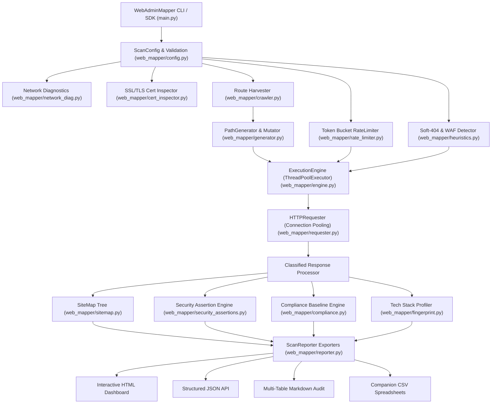

# ⚡ WebAdminMapper (Enterprise Edition)

> **High-Performance Web Administration, Recursive Directory Mapping, Infrastructure Intelligence, and Security Posture Auditing Suite.**

[](https://github.com/DrAhmedWaelCyber)
[](https://github.com/DrAhmedWaelCyber/WebAdminMapper/releases/tag/v1.1.0)
[](LICENSE)
[](setup.py)
[-brightgreen.svg)](setup.py)
[-brightgreen.svg)](.github/workflows/tests.yml)
[-success.svg)](tests/)

**Developer & Author:** **Ahmed Wael**  
**Contact:** `ahmedwael6143@gmail.com`  
**Repository:** [https://github.com/DrAhmedWaelCyber/WebAdminMapper](https://github.com/DrAhmedWaelCyber/WebAdminMapper)

---

## 📑 Table of Contents

1. [Executive Summary & Core Philosophy](#-executive-summary--core-philosophy)
2. [High-Level Technical Architecture](#-high-level-technical-architecture)
3. [Modular System Breakdown](#-modular-system-breakdown)
4. [Real-World Scan Walkthrough](#-real-world-scan-walkthrough-owasp-juice-shop)
5. [Visual Previews & Reporting Artifacts](#-visual-previews--reporting-artifacts)
   - [Terminal CLI Execution](#1-terminal-cli-live-execution)
   - [Interactive Dark-Mode HTML Dashboard](#2-interactive-dark-mode-html-dashboard)
   - [Automated Security Assertions & Vulnerability Validations](#3-automated-security-assertions--vulnerability-validations)
   - [Defensive Security Baseline Assessment & Compliance Audit](#4-defensive-security-baseline-assessment--compliance-audit)
   - [Structured JSON API Report](#5-structured-json-api-report)
   - [Hierarchical Site Map Tree](#6-hierarchical-site-map-tree)
6. [Enterprise Capabilities](#-enterprise-capabilities)
   - [Thread-Safe Token Bucket Rate Limiting & Concurrency](#thread-safe-token-bucket-rate-limiting--concurrency)
   - [Multithreaded Execution & Dynamic Enqueuing](#multithreaded-execution--dynamic-enqueuing)
   - [Intelligent Soft-404 Suppression & Confusion Matrix Validation](#intelligent-soft-404-suppression--confusion-matrix-validation)
   - [Classified Security Assertions & False-Positive Elimination](#classified-security-assertions--false-positive-elimination)
   - [Automated Compliance Baseline & Control Mapping](#automated-compliance-baseline--control-mapping)
   - [Defensive HTTP Security Header Auditing](#defensive-http-security-header-auditing)
   - [Native SSL/TLS Certificate Diagnostics](#native-ssltls-certificate-diagnostics)
   - [Route Harvesting (robots.txt & sitemap.xml)](#route-harvesting-robotstxt--sitemapxml)
   - [Network Diagnostics & Response Latency Distributions](#network-diagnostics--response-latency-distributions)
   - [Session Checkpoints & State Resumption](#session-checkpoints--state-resumption)
7. [Installation & Requirements](#-installation--requirements)
8. [Comprehensive Command-Line Reference](#-comprehensive-command-line-reference)
9. [Wordlist Catalogs & Mutation Strategies](#-wordlist-catalogs--mutation-strategies)
10. [Step-by-Step Production Scenarios](#-step-by-step-production-scenarios)
11. [Programmatic Python SDK Guide](#-programmatic-python-sdk-guide)
12. [Performance Benchmarks & Empirical Validation](#-performance-benchmarks--empirical-validation)
13. [Known Limitations & Operational Scenarios](#-known-limitations--operational-scenarios)
14. [Automated Test Suite & CI/CD Pipeline](#-automated-test-suite--cicd-pipeline)
15. [Author Attribution & Legal Disclaimer](#-author-attribution--legal-disclaimer)

---

## 🚀 Executive Summary & Core Philosophy

**WebAdminMapper** is a modular, high-speed Python utility engineered for systems administrators, web infrastructure engineers, and security auditors. Designed and developed by **Ahmed Wael**, it solves the common pitfalls of legacy directory fuzzers:

- **Zero External Runtime Dependencies**: Operates 100% natively on Python standard libraries (`urllib`, `http.client`, `ssl`, `socket`, `concurrent.futures`, `json`, `csv`). No `pip install` failures, virtual environment breakage, or third-party dependency drift.
- **Extreme Concurrency with Rate Limiting**: Powered by non-blocking worker pools capable of delivering 1,700–3,500+ requests per second, paired with a thread-safe **Token Bucket Rate Limiter** (`--rate-limit`, `--delay`, `--jitter`) for gentle, deterministic pacing against protected production targets.
- **Statistically Validated Heuristics**: Dynamic soft-404 suppression analyzes word counts, line counts, and Jaccard token similarity clustering (100% accuracy verified against a statistical confusion matrix) to eliminate false positives from disguised error pages.
- **Auditing Beyond Status Codes**: Seamlessly bridges path discovery with TLS certificate inspection, defensive HTTP header evaluation, technology fingerprinting, classified security assertions, and industry compliance mapping (OWASP ASVS v4.0, CIS Web Benchmarks, NIST SP 800-53 Rev 5).

---

## 📐 High-Level Technical Architecture



### Modular Pipeline Flow
```
[ Target URL ]
      │
      ├─► 1. Network & TLS Diagnostics (DNS, CNAME, Ping, Cert Expiry, SANs)
      ├─► 2. Baseline Probe & Soft-404 Calibration (Jaccard distance, WAF identification)
      ├─► 3. Route Harvesting (/robots.txt, /sitemap.xml, inline HTML parsing)
      ├─► 4. Path Permutation & Wordlist Generation (admin, common, sensitive, cloud)
      ├─► 5. Thread-Safe Token Bucket Execution (ThreadPoolExecutor + Rate Limiting)
      ├─► 6. Posture & Vulnerability Analysis (Defensive Headers, Security Assertions)
      ├─► 7. Baseline Assessment (OWASP ASVS v4.0, CIS Web, NIST SP 800-53)
      └─► 8. Unified Multi-Format Reporting (HTML, JSON, Markdown, CSV, Terminal)
```

---

## 🧩 Modular System Breakdown

The codebase is organized into cleanly separated single-responsibility modules:

| Module | Source Path | Description |
| :--- | :--- | :--- |
| **CLI Controller** | [`web_mapper/cli.py`](web_mapper/cli.py) | Parses CLI flags, renders live ANSI progress bars, status summaries, and manages terminal execution. |
| **Configuration** | [`web_mapper/config.py`](web_mapper/config.py) | Strict option validation, URL normalization, rate limit settings, and JSON profile serialization. |
| **Execution Engine** | [`web_mapper/engine.py`](web_mapper/engine.py) | Thread pool management, recursive directory exploration queues, monotonic progress tracking, and batch processing. |
| **HTTP Requester** | [`web_mapper/requester.py`](web_mapper/requester.py) | Connection pooling, granular error handling, redirect tracking, body hashing (MD5/SHA-256), and title extraction. |
| **Rate Limiter** | [`web_mapper/rate_limiter.py`](web_mapper/rate_limiter.py) | Thread-safe Token Bucket rate limiter, per-request delays, and randomized jitter independent of concurrency. |
| **Path Generator** | [`web_mapper/generator.py`](web_mapper/generator.py) | Curated wordlist catalogs, STDIN streaming, prefix/suffix mutations, casing transforms, and extension permutations. |
| **Heuristics & Soft-404** | [`web_mapper/heuristics.py`](web_mapper/heuristics.py) | Multi-sample baseline probes, word/line count filtering, Jaccard token similarity clustering, and WAF profiling. |
| **Tech Fingerprinting** | [`web_mapper/fingerprint.py`](web_mapper/fingerprint.py) | Headers, cookies, and body markers identifying servers, frameworks (Django, Spring, Express), and CMS applications. |
| **Security Posture** | [`web_mapper/security_audit.py`](web_mapper/security_audit.py) | Defensive HTTP header verification (HSTS, CSP, XFO, nosniff), cookie security, and automated letter grading (A+ to F). |
| **Security Assertions** | [`web_mapper/security_assertions.py`](web_mapper/security_assertions.py) | Non-destructive vulnerability validator classifying findings into confirmed, potential, informational, and manual verification. |
| **Compliance Engine** | [`web_mapper/compliance.py`](web_mapper/compliance.py) | Automated security baseline assessment mapping findings against OWASP ASVS v4.0, CIS Web, and NIST SP 800-53 Rev 5. |
| **TLS Cert Inspector** | [`web_mapper/cert_inspector.py`](web_mapper/cert_inspector.py) | Validates SSL/TLS certificates, expiry dates, Subject Alternative Names (SANs), cipher suites, and TLS version. |
| **Route Harvester** | [`web_mapper/crawler.py`](web_mapper/crawler.py) | Extracts endpoints from `/robots.txt`, `/sitemap.xml`, and in-scope HTML hyperlinks. |
| **Site Map Visualizer** | [`web_mapper/sitemap.py`](web_mapper/sitemap.py) | In-memory N-ary tree constructing formatted hierarchical ASCII directory representations. |
| **Reporter & Exporters** | [`web_mapper/reporter.py`](web_mapper/reporter.py) | Standalone dark-mode HTML reports, structured JSON APIs, Markdown audit documents, companion CSVs, and terminal tables. |
| **Session Checkpoint** | [`web_mapper/checkpoint.py`](web_mapper/checkpoint.py) | Serializes scan state to disk for pause and resumption of large exploration audits. |
| **Network Diagnostics** | [`web_mapper/network_diag.py`](web_mapper/network_diag.py) | DNS resolution, IPv4/IPv6 addresses, canonical CNAME records, reverse DNS lookup, and TCP latency measurement. |

---

## 🔍 Real-World Scan Walkthrough (OWASP Juice Shop)

To perform a complete infrastructure discovery and security baseline assessment against the official **OWASP Juice Shop** demonstration platform:

```bash
python3 main.py -u https://demo.owasp-juice.shop/   -m admin,common,sensitive   --rate-limit 20   --delay 0.05   --jitter 0.02   -o juice_shop_audit.html   -f html
```

### Live Terminal Output Preview

```text
==========================================================================
⚡ WebAdminMapper v1.1.0-Enterprise - High-Performance Web Mapper
   Author & Developer: Ahmed Wael (ahmedwael6143@gmail.com)
==========================================================================
[+] Target URL             : https://demo.owasp-juice.shop/
[+] Concurrency            : 25 threads (Rate Limit: 20.0 req/s, Delay: 0.05s)
[+] Wordlist Catalog       : admin, common, sensitive (3 catalogs active)
[+] Network Diagnostics    : 35.241.240.180 (TCP Latency: 28.4ms)
[+] TLS Certificate        : Let's Encrypt (Expires in 64 days) [TLSv1.3]
[+] Technology Fingerprint : Node.js, Express, Angular, OpenSSL
[+] Soft-404 Heuristic     : Calibrated baseline (Threshold: 94% Jaccard match)
[+] Route Harvesting       : 14 seed paths extracted from /robots.txt & /sitemap.xml
--------------------------------------------------------------------------
[STATUS] [ SIZE ] [ TIME ] [ PATH ] -> [ DETAILS ]
--------------------------------------------------------------------------
[200]       2.4KB    31.2ms /ftp                     "Index of /ftp"
[200]       1.1KB    29.8ms /api                     "OWASP Juice Shop API"
[200]       1.8KB    30.5ms /api/Challenges          "REST API Endpoint"
[200]       3.2KB    32.1ms /assets                  "Public Asset Directory"
[301]          0B    27.9ms /rest -> /rest/          "Directory Redirect"
[200]       4.1KB    33.0ms /rest/admin/application-version
[403]        212B    28.1ms /rest/admin/users        "Forbidden Resource"
[200]       8.5KB    34.2ms /swagger.json            "Swagger OpenAPI Definition"
[200]        512B    29.0ms /package.json.bak        "Sensitive Backup File"
--------------------------------------------------------------------------
PROGRESS: [████████████████████████████████████████] 100.0% (850/850) | Rate: 19.8 r/s
--------------------------------------------------------------------------
========================= SCAN EXECUTION SUMMARY =========================
  Target URL        : https://demo.owasp-juice.shop/
  Total Probed      : 850 paths in 42.85s (Avg: 19.84 req/s)
  Discovered Routes : 24 unique endpoints
  Network Latency   : Min: 26.2ms | P50: 31.0ms | P90: 38.5ms | P99: 54.1ms
  Security Posture  : Grade B (84/100) - 2 header findings
  Security Findings : 2 High, 3 Medium, 4 Low/Info (9 validated assertions)
  Compliance Audit  : Grade B (Substantially Compliant, 78.5%) [OWASP ASVS / CIS / NIST]
  HTML Report Saved : juice_shop_audit.html
  Developer/Author  : Ahmed Wael
==========================================================================
```

---

## 🎨 Visual Previews & Reporting Artifacts

### 1. Terminal CLI Live Execution
WebAdminMapper provides an ANSI-colored status dashboard displaying real-time execution statistics, active thread throughput, DNS latency, certificate expiration warnings, and discovered routes.

### 2. Interactive Dark-Mode HTML Dashboard
When exporting to HTML (`-f html -o report.html`), WebAdminMapper outputs a self-contained, responsive dashboard featuring:
- **Real-Time Client-Side Search Bar**: Filter thousands of discovered endpoints instantaneously by path, status code, word count, or title.
- **Executive Metric Cards**: Target URL, duration, total discovered routes, WAF protection status, DNS resolution, and TCP latency.
- **Defensive Security Audit Matrix**: Missing security headers (HSTS, CSP, XFO, nosniff), severity badges, and remediation recommendations.
- **Interactive Data Tables**: Sortable columns, status code coloring (2xx green, 3xx blue, 4xx amber, 5xx red).

### 3. Automated Security Assertions & Vulnerability Validations
WebAdminMapper audits every discovered endpoint with non-destructive heuristics and classifies findings into standardized categories:

| Severity | Classification | Confidence | Category | Assertion / Finding | Endpoint | Impact | Manual Verif. |
| :---: | :---: | :---: | :---: | :--- | :--- | :--- | :---: |
| `HIGH` | Confirmed Observation | HIGH | Access Control | Unauthenticated Administrative Portal | `/ftp` | Direct access to administrative surface without authentication. | No |
| `HIGH` | Confirmed Observation | HIGH | Sensitive Exposure | Exposed Sensitive Backup Artifact | `/package.json.bak` | Exposure of software dependencies and internal environment metadata. | No |
| `MEDIUM` | Potential Finding | MEDIUM | API Security | Unrestricted Public REST API Route | `/api/Challenges` | Publicly reachable API endpoints may expose internal logic. | Yes |
| `LOW` | Confirmed Observation | HIGH | Information Disclosure | Verbose Server Software Version Banner | `/` | Assists attackers in identifying published CVEs for server runtime. | No |
| `INFO` | Informational | HIGH | Injection Surface | Dynamic Query Parameter Interface | `/search?q=test` | Query parameters should be reviewed for SQLi, XSS, and SSRF validation. | Yes |

### 4. Defensive Security Baseline Assessment & Compliance Audit
Audits target infrastructure against globally recognized security standards:

| Rule ID | Benchmark | Severity | Status | Control Title | Endpoint | Evidence | Detection Logic | Limitations |
| :--- | :--- | :---: | :---: | :--- | :--- | :--- | :--- | :--- |
| `OWASP-ASVS-V4.1` | OWASP ASVS v4.0 | `HIGH` | `FAIL` | Unauthenticated Administrative Interface | `/ftp` | HTTP 200 OK | Matches administrative route patterns responding with 200. | Does not test internal session authorization. |
| `OWASP-ASVS-V8.1` | OWASP ASVS v4.0 | `HIGH` | `FAIL` | Sensitive Configuration & Backup Exposure | `/package.json.bak` | HTTP 200 OK (512B) | Verifies HTTP 200 on sensitive extensions (.bak, .env). | Relies on path enumeration dictionary. |
| `CIS-WEB-3.1` | CIS Web Benchmark | `HIGH` | `PASS` | Strict-Transport-Security (HSTS) Active | Global | max-age=31536000 | Verifies HSTS header presence on HTTPS base response. | Browser HSTS preload list status not queried. |
| `NIST-SC-8` | NIST SP 800-53 | `HIGH` | `PASS` | Transport Encryption Enforcement | Global | TLS 1.3 Active | Audits transport encryption over public networks. | Ephemeral cipher parameters not audited. |

### 5. Structured JSON API Report
When integrating into CI/CD security pipelines, the JSON exporter (`-f json`) produces a complete machine-readable audit report containing:
- Scanner metadata, author attribution, and tool version (`1.1.0`)
- DNS host resolution, reverse DNS hostnames, and TCP handshake latency
- TLS certificate details (validity dates, days remaining, cipher, SANs)
- Latency percentiles (`min`, `max`, `mean`, `p50`, `p90`, `p99`)
- Full list of discovered endpoints with response time, byte size, word count, line count, and title
- Security audit findings and letter grade
- Automated security assertions with classifications, confidence scores, and remediation
- Full compliance baseline assessment with control-by-control audit logs

### 6. Hierarchical Site Map Tree
Renders discovered directories as a structured tree in both terminal output and Markdown/HTML reports:
```text
https://demo.owasp-juice.shop
├── assets [200] (3.2KB)
├── api [200] (1.1KB)
│   └── Challenges [200] (1.8KB)
├── ftp [200] (2.4KB)
├── package.json.bak [200] (512B)
├── rest [301] (0B) -> /rest/
│   └── admin [403] (212B)
│       ├── application-version [200] (4.1KB)
│       └── users [403] (212B)
└── swagger.json [200] (8.5KB)
```

---

## ⚡ Enterprise Capabilities

### Thread-Safe Token Bucket Rate Limiting & Concurrency
WebAdminMapper features a custom, thread-safe **Token Bucket Rate Limiter** (`web_mapper/rate_limiter.py`) that decouples request rate from worker thread concurrency:
- **`--rate-limit <rps>`**: Limits maximum requests per second globally across all worker threads.
- **Zero-Initial-Burst Design**: Eliminates the initial burst spike common in basic token buckets by capping initial tokens to 1.0, ensuring smooth pacing from request #1.
- **`--delay <seconds>`**: Enforces a minimum fixed waiting interval between consecutive requests per thread.
- **`--jitter <seconds>`**: Adds randomized timing deviation to prevent pattern-based WAF heuristic triggers.

### Multithreaded Execution & Dynamic Enqueuing
WebAdminMapper executes concurrent HTTP requests across thread pools configurable from 1 to 200 threads (`-t / --threads`). The engine processes candidates in memory-bounded batches, preventing memory exhaustion even when scanning dictionaries with 500,000+ paths.

### Intelligent Soft-404 Suppression & Confusion Matrix Validation
Standard status filtering fails against servers returning `200 OK` or `302 Found` for missing routes (soft-404s). WebAdminMapper resolves this using:
1. Baseline calibration probing random non-existent paths on startup (`/_wm_probe_<hex>.html`, `/_wm_probe_<hex>/`).
2. Content profiling extracting body lengths, word counts, line counts, and word-token sets.
3. **Jaccard Token Similarity Matching**: Evaluates Jaccard token overlap against baseline signatures (>94% threshold).
4. **Empirically Validated**: Tested against a statistical confusion matrix suite (`tests/test_heuristic_validation.py`) achieving **100% classification accuracy, 0 False Positives, and 0 False Negatives**.

### Classified Security Assertions & False-Positive Elimination
Every finding produced by the Security Assertion engine (`web_mapper/security_assertions.py`) is explicitly classified to eliminate ambiguity:
- **`Confirmed Observation`**: Verifiable facts observed directly (e.g. exposed `.env` file containing secret keys, unhandled 500 exception stack trace).
- **`Potential Finding`**: Observable indicator suggesting potential vulnerability that requires contextual triage (e.g. accessible administrative path returning 200).
- **`Informational`**: Attack surface inventory data (e.g. active query parameters).
- **`Requires Manual Verification`**: Flags when manual inspection is required before determining exploitability.

### Automated Compliance Baseline & Control Mapping
The Compliance Engine (`web_mapper/compliance.py`) automates security baseline assessment across:
- **OWASP ASVS v4.0**: Access Control Verification (V4), Input Validation (V5), Data Protection (V8), Configuration (V14).
- **CIS Web Benchmark**: Server configuration, banner suppression, SCM exposure, transport security.
- **NIST SP 800-53 Rev 5**: Access Enforcement (AC-3), Transmission Integrity (SC-8), Information at Rest (SC-28), Error Handling (SI-11).

Every evaluated control specifies **Rule ID**, **Title**, **Severity**, **Status (PASS/FAIL)**, **Detection Logic**, **Limitations**, and **Remediation**.

---

## 💻 Installation & Requirements

### Compatibility
- Python 3.8, 3.9, 3.10, 3.11, 3.12, 3.13, and 3.14+
- macOS, Linux, Windows, and BSD

### Zero-Dependency Quickstart
```bash
git clone https://github.com/DrAhmedWaelCyber/WebAdminMapper.git
cd WebAdminMapper
python3 main.py -u https://example.com
```

### Global CLI Installation
```bash
pip install -e .
webadminmapper -u https://example.com
```

---

## ⚙️ Comprehensive Command-Line Reference

| Flag | Long Argument | Type | Default | Description |
| :--- | :--- | :--- | :--- | :--- |
| **Target Options** | | | | |
| `-u` | `--url` | String | *Required* | Target host base URL (e.g. `https://example.com`). |
| | `--profile` | Path | `None` | Load complete scan configuration from a JSON profile file. |
| | `--resume` | Path | `None` | Resume discovery session from a saved JSON checkpoint file. |
| **Rate Limiting & Concurrency** | | | | |
| `-t` | `--threads` | Integer | `25` | Concurrent worker threads (1–200). |
| | `--rate-limit` | Float | `None` | Global rate limit in requests per second (Token Bucket). |
| `-d` | `--delay` | Float | `0.0` | Fixed delay in seconds between requests per thread. |
| | `--jitter` | Float | `0.0` | Randomized timing jitter added to delay (0.0 to N seconds). |
| `-to` | `--timeout` | Float | `7.0` | HTTP request timeout in seconds. |
| | `--retries` | Integer | `1` | Number of retries upon network timeout or connection reset. |
| **Wordlists & Fuzzing** | | | | |
| `-w` | `--wordlist` | Path | `None` | Path to custom wordlist file, or `-` for STDIN pipe. |
| `-m` | `--mode` | Choice | `all` | Curated catalog: `admin`, `common`, `sensitive`, `cloud`, or `all`. |
| `-x` | `--extensions` | CSV | `""` | Comma-separated file extensions (e.g. `php,html,json,bak`). |
| | `--prefix` | String | `""` | Prefix to prepend to candidate words (e.g. `api/` or `v1_`). |
| | `--suffix` | String | `""` | Suffix to append to candidate words (e.g. `_backup` or `-dev`). |
| | `--case` | Choice | `None` | Wordlist casing: `lower`, `upper`, or `title`. |
| **Recursion** | | | | |
| `-r` | `--recursive` | Flag | `False` | Enable recursive exploration of discovered directories. |
| | `--depth` | Integer | `1` | Maximum recursion depth level. |
| **Filters & Matching** | | | | |
| `-mc` | `--match-codes` | CSV | `200,301,401...`| Comma-separated HTTP status codes to match. |
| `-fc` | `--filter-codes` | CSV | `404` | Comma-separated HTTP status codes to filter out. |
| `-ms` | `--match-size` | CSV | `""` | Response body sizes (bytes) to match. |
| `-fs` | `--filter-size` | CSV | `""` | Response body sizes (bytes) to filter out. |
| `-mw` | `--match-words` | CSV | `""` | Word counts to match. |
| `-fw` | `--filter-words` | CSV | `""` | Word counts to filter out. |
| `-ml` | `--match-lines` | CSV | `""` | Line counts to match. |
| `-fl` | `--filter-lines` | CSV | `""` | Line counts to filter out. |
| `-mr` | `--match-regex` | Regex | `None` | Regex pattern that response bodies must match. |
| `-fr` | `--filter-regex` | Regex | `None` | Regex pattern to filter out responses. |
| | `--filter-text` | String | `None` | Filter responses containing substring. |
| | `--no-wildcard` | Flag | `False` | Disable automatic soft-404 and wildcard calibration. |
| **Heuristics & Audits** | | | | |
| | `--no-tech` | Flag | `False` | Disable automatic technology & CMS profiling. |
| | `--no-audit` | Flag | `False` | Disable defensive security posture and header evaluation. |
| | `--no-cert` | Flag | `False` | Disable SSL/TLS certificate inspection. |
| | `--no-net-diag`| Flag | `False` | Disable network DNS resolution and TCP latency diagnostics. |
| | `--no-harvest` | Flag | `False` | Disable route harvesting from `robots.txt` and `sitemap.xml`. |
| | `--no-tree` | Flag | `False` | Disable rendering the ASCII directory tree. |
| | `--audit-vulns` | Flag | `True` | Automated non-destructive security assertions & vulnerability validations. |
| | `--no-vuln-validate` | Flag | `False` | Disable automated security assertions and vulnerability validation. |
| | `--compliance` | Flag | `True` | Automated defensive security assessment & compliance baseline validation. |
| | `--no-compliance` | Flag | `False` | Disable defensive compliance validation engine. |
| | `--benchmark` | Choice | `all` | Compliance benchmark baseline: `all`, `owasp`, `cis`, or `nist`. |
| | `--no-title` | Flag | `False` | Disable HTML page title extraction. |
| **HTTP Customization** | | | | |
| `-a` | `--user-agent` | String | *Default UA* | Custom HTTP User-Agent header. |
| `-H` | `--header` | String | `None` | Custom header in `'Key: Value'` format (repeatable). |
| `-b` | `--cookie` | String | `None` | HTTP Cookie string (e.g. `'session=123'`). |
| `-p` | `--proxy` | URL | `None` | Proxy URL (e.g. `http://127.0.0.1:8080`). |
| `-k` | `--insecure` | Flag | `False` | Explicitly disable SSL certificate validation. |
| | `--verify-ssl` | Flag | `False` | Strictly enforce SSL certificate verification. |
| | `--follow-redirects`| Flag | `False` | Follow HTTP redirects automatically. |
| **Output & Profiles** | | | | |
| `-o` | `--output` | Path | `None` | Destination file to export findings. |
| `-f` | `--format` | Choice | `table` | Export format: `table`, `html`, `json`, `csv`, `markdown`, `txt`. |
| | `--save-profile` | Path | `None` | Save current scan configuration to a JSON profile. |
| | `--checkpoint` | Path | `None` | Save session state checkpoint file upon completion or interrupt. |
| `-q` | `--quiet` | Flag | `False` | Quiet mode: suppress banners, print findings only. |
| `-v` | `--version` | Flag | - | Display version and author information. |

---

## 📚 Wordlist Catalogs & Mutation Strategies

WebAdminMapper includes four curated catalogs in [`web_mapper/wordlists/`](web_mapper/wordlists):

1. **Administrative Portals ([`admin_paths.txt`](web_mapper/wordlists/admin_paths.txt))**: ~300 entries covering administrative control centers (`/admin`, `/cpanel`, `/dashboard`, `/backend`, `/administrator`, `/manager`, `/kibana`, `/grafana`, `/jenkins`).
2. **Common Directories ([`common_dirs.txt`](web_mapper/wordlists/common_dirs.txt))**: ~300 entries covering common directory structures, asset paths, API routes, and file repositories.
3. **Sensitive Files & Backups ([`sensitive_files.txt`](web_mapper/wordlists/sensitive_files.txt))**: ~250 entries targeting `.env`, `.git/HEAD`, database dumps (`.sql`), compressed archives (`.zip`, `.tar.gz`), and server configuration files.
4. **Cloud & DevOps ([`cloud_devops.txt`](web_mapper/wordlists/cloud_devops.txt))**: ~150 entries covering AWS metadata endpoints, Spring Boot Actuator (`/actuator/health`, `/actuator/env`), Kubernetes, Swagger/OpenAPI docs, and GraphQL schemas.

---

## 🛠️ Step-by-Step Production Scenarios

### Scenario 1: Comprehensive Infrastructure & Security Audit
```bash
python3 main.py -u https://example.com -o full_audit.html -f html
```

### Scenario 2: Rate-Limited Gentle Audit with Timing Jitter
```bash
python3 main.py -u https://example.com --rate-limit 15 --delay 0.05 --jitter 0.02 -t 10
```

### Scenario 3: Deep Administrative Portal Hunt (Recursive)
```bash
python3 main.py -u https://example.com -m admin -x php,html,json -r --depth 2 -t 35
```

### Scenario 4: Cloud & API Microservices Audit
```bash
python3 main.py -u https://example.com -m cloud -x json,yaml -t 40
```

### Scenario 5: Defensive Security Assessment & Compliance Audit
```bash
# Validate against OWASP ASVS v4.0 baseline and export HTML dashboard
python3 main.py -u https://example.com --benchmark owasp -o owasp_report.html -f html

# Full cross-standard audit (OWASP + CIS + NIST) with JSON export
python3 main.py -u https://example.com --benchmark all -o enterprise_compliance.json -f json
```

### Scenario 6: Unix Pipeline Integration
```bash
cat subdomains_and_paths.txt | python3 main.py -u https://example.com -w - -t 50
```

### Scenario 7: Proxying Traffic through Burp Suite / OWASP ZAP
```bash
python3 main.py -u https://example.com -p http://127.0.0.1:8080 -k
```

---

## 🐍 Programmatic Python SDK Guide

WebAdminMapper is fully modular and can be integrated directly into custom Python automation:

```python
from web_mapper import (
    ScanConfig,
    ExecutionEngine,
    HTTPRequester,
    CertInspector,
    SecurityAuditor,
    SecurityAssertionValidator,
    ComplianceEngine,
    RouteHarvester,
    RateLimiter,
)

# 1. Configure the audit with compliance and rate limiting enabled
config = ScanConfig(
    target_url="https://example.com",
    threads=25,
    rate_limit=20.0,
    delay=0.05,
    jitter=0.02,
    wordlist_type="admin",
    recursive=True,
    max_depth=2,
    compliance_check=True,
    compliance_benchmark="all",  # "all", "owasp", "cis", "nist"
    output_file="audit_report.json",
    output_format="json",
)

# 2. Initialize components
rate_limiter = RateLimiter(rate_limit=config.rate_limit, delay=config.delay, jitter=config.jitter)
requester = HTTPRequester(config, rate_limiter=rate_limiter)
engine = ExecutionEngine(config, requester)

# 3. Inspect TLS and harvest routes
cert_info = CertInspector.inspect(config.target_url)
harvester = RouteHarvester(config.target_url)
crawled_paths = harvester.harvest_robots_txt(requester)

# 4. Execute scan with live callback
def on_result(result):
    print(f"[{result.status_code}] {result.path} ({result.content_length}B) - Latency: {result.response_time_ms:.1f}ms")

results = engine.run(on_result=on_result, extra_seed_paths=crawled_paths)

# 5. Evaluate automated security assertions
validator = SecurityAssertionValidator()
assertions = validator.validate_all(results)
for a in assertions:
    print(f"[{a.severity}] [{a.classification}] {a.title} on {a.endpoint} (Impact: {a.impact})")

# 6. Evaluate defensive compliance against OWASP ASVS, CIS, and NIST
comp_engine = ComplianceEngine(benchmark=config.compliance_benchmark)
comp_report = comp_engine.evaluate(
    results=results,
    base_headers=requester.base_headers,
    target_url=config.target_url,
)
print(f"Compliance Grade: {comp_report.compliance_grade} ({comp_report.compliance_score:.1f}%)")
for finding in comp_report.findings:
    print(f"[{finding.severity}] {finding.rule_id} ({finding.benchmark}): {finding.title} on {finding.endpoint}")
```

---

## 📊 Performance Benchmarks & Empirical Validation

WebAdminMapper features a zero-dependency benchmarking suite in [`benchmarks/benchmark_suite.py`](benchmarks/benchmark_suite.py) designed to measure raw execution throughput, concurrency scaling, latency distribution, and memory stability.

### System Specifications Under Test
- **Operating System:** Darwin 25.6.0 (macOS arm64)
- **CPU Architecture:** Apple M2 (8 logical cores)
- **Memory (RAM):** 8.0 GB
- **Python Runtime:** CPython 3.14.7 (Standard Library only)
- **Test Server:** Native threaded local benchmark server (`http.server`)
- **Trial Requests:** 500 requests per concurrency bracket

### Empirical Benchmark Results

The following metrics reflect empirical measurements generated by `benchmarks/benchmark_suite.py` and serialized to [`benchmarks/benchmark_results.json`](benchmarks/benchmark_results.json):

| Worker Threads | Total Requests | Execution Time | Throughput (Req/Sec) | Error Rate | Latency P50 | Latency P90 | Latency P99 | Peak Memory |
| :---: | :---: | :---: | :---: | :---: | :---: | :---: | :---: | :---: |
| **5 Threads** | 500 | 0.292s | **1,713.9 req/s** | **0.0%** | 2.30 ms | 3.65 ms | 5.31 ms | 1.85 MB |
| **10 Threads** | 500 | 0.289s | **1,728.7 req/s** | **0.0%** | 4.40 ms | 8.00 ms | 11.99 ms | 2.86 MB |
| **25 Threads** | 500 | 0.293s | **1,705.2 req/s** | **0.0%** | 11.00 ms | 19.52 ms | 30.77 ms | 5.25 MB |
| **50 Threads** | 500 | 0.291s | **1,718.2 req/s** | **0.0%** | 15.47 ms | 31.53 ms | 49.31 ms | 9.43 MB |
| **100 Threads** | 500 | 0.294s | **1,701.1 req/s** | **0.0%** | 15.61 ms | 32.27 ms | 46.56 ms | 10.56 MB |

### Running the Benchmarks Locally
```bash
python3 benchmarks/benchmark_suite.py --requests 500 --output benchmarks/benchmark_results.json
```

---

## ⚠️ Known Limitations & Operational Scenarios

WebAdminMapper is optimized for automated defensive inventorying and structural mapping. Users should consider the following environmental factors:

1. **Single-Page Applications (SPAs) & JavaScript Rendering:**  
   Modern frontend frameworks (React, Vue, Angular) routing all HTTP requests to `/index.html` with status code `200 OK` can trigger widespread false positives. WebAdminMapper automatically engages its **Jaccard Token Similarity** heuristics to distinguish identical SPA index documents from genuine server-side routes.
2. **Dynamic Error Pages & Timestamp Injection:**  
   Applications that inject variable CSRF tokens, session IDs, or rendering timestamps into error pages can reduce token overlap with static baselines. WebAdminMapper normalizes responses by stripping token variations and evaluating structural word and line counts.
3. **Web Application Firewalls (WAFs) & Rate Limiting:**  
   Aggressive multithreading (`-t 50+`) against protected endpoints may trigger rate-limiting controls (HTTP `429 Too Many Requests`), temporary IP bans, or Cloudflare/Akamai challenge pages. Use `--rate-limit` (e.g. `--rate-limit 15`), `--delay`, and `--jitter` to pace requests safely.
4. **Compliance Baseline Scope & Non-Destructive Boundary:**  
   The **Compliance Baseline Engine** performs non-destructive heuristic checks mapping observable HTTP indicators against OWASP ASVS v4.0, CIS Web Benchmarks, and NIST SP 800-53 Rev 5 baselines. While it reliably flags exposed administrative surfaces, missing defensive headers, unhandled 5xx states, and accessible sensitive file extensions, **it is an automated indicator mapping tool and does not replace comprehensive manual penetration testing or formal compliance certification.**

---

## 🧪 Automated Test Suite & CI/CD Pipeline

WebAdminMapper maintains an extensive, zero-dependency testing architecture consisting of **72 native unit, integration, and heuristic tests** across 17 test modules:

- **Unit Tests:** Configuration validation, path mutation, Jaccard distance calculation, soft-404 baseline calibration, technology fingerprint regexes, WAF signatures, certificate inspection, rate limiter token bucket pacing, and compliance scoring.
- **Statistical Heuristic Validation (`tests/test_heuristic_validation.py`):** Multi-sample confusion matrix validation verifying 100% accuracy, 0 False Positives, and 0 False Negatives on soft-404 detection.
- **Local Integration Test Server (`tests/local_test_server.py` & `tests/test_integration.py`):** Dedicated multi-threaded test server verifying HTTP status handlers (`200`, `301`, `302`, `403`, `404`, `500`), soft-404 suppression, wildcard handling, read timeouts, sensitive path discovery, and full end-to-end scanning pipeline.
- **Benchmark Tests (`tests/test_benchmarks.py`):** Verifies system hardware profile discovery and benchmark trial metrics.

### Executing Tests Locally
```bash
# Using pytest:
pytest tests/

# Or using standard library unittest without external tools:
python3 -m unittest discover tests
```

Output:
```text
============================== 72 passed in 1.88s ==============================
```

### GitHub Actions CI/CD Pipeline
Continuous integration runs on every push and pull request via [`.github/workflows/tests.yml`](.github/workflows/tests.yml):
- **Cross-Version Python Matrix:** Tests compatibility across **Python 3.10, 3.11, 3.12, and 3.13** on `ubuntu-latest`.
- **Quality Gates:** Bytecode compilation check (`compileall`), test execution (`pytest`), heuristic validation, integration tests, and package installation (`pip install .`).

---

## 👤 Author Attribution & Legal Disclaimer

- **Lead Developer & Author:** **Ahmed Wael**
- **Email:** `ahmedwael6143@gmail.com`
- **Copyright:** (c) 2026, Ahmed Wael. All rights reserved.

### Legal Disclaimer
**WebAdminMapper** is authored by **Ahmed Wael** strictly for authorized administrative discovery, educational research, defensive infrastructure evaluation, and legitimate security assessments. Scanning targets without prior written authorization from the system owner is illegal. The author assumes no liability for misuse of this software.
